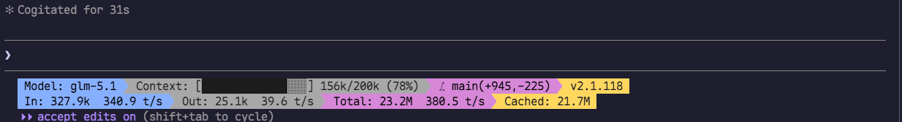
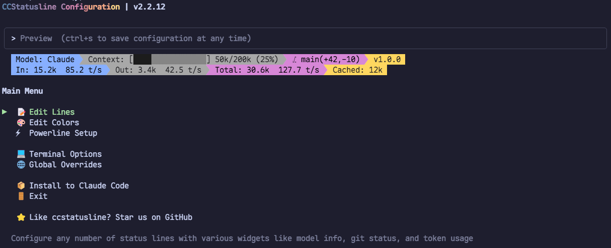

# Claude Code 使用指南

## 入门 + 进阶 + Tips

中研院 数据平台 · 蒋正颀

jiangzhengqi@fmsh.com.cn


<div class="abs-br m-6 flex gap-2 text-sm opacity-50">
  <span>2026.05</span>
</div>

---
layout: intro
hideInToc: true
---

# 目录

<Toc :columns="4" :maxDepth="1" />


---
layout: intro
hideInToc: true
---

# 目录

<Toc :columns="4" />

---

## 什么是 Claude Code

<div grid="~ cols-2 gap-8">

<div>

- Anthropic 发布的 **Agentic Coding CLI 工具**, 在终端中直接与 Claude *(或其他 LLM)* 对话完成编码任务
- 不一定是最好的，但是 MCP、Skills 等概念都是 Anthropic 提出的，是 Agent 发展的最前沿

**核心能力**

- **读** — 理解整个代码库结构、依赖关系
- **写** — 编辑文件、创建新文件、重构代码
- **执行** — 运行命令、测试、构建、部署
- **集成** — Git、MCP、LSP、Hooks、Plugins

**工作方式**：Agentic Loop（自主循环）

```
理解需求 → 收集上下文 → 执行操作 → 验证结果 → 继续迭代
```

</div>

<div>

**为什么用 Claude Code**

| 优势 | 说明 |
|------|------|
| 终端原生 | 深度系统访问，不受 IDE 限制 |
| 全项目感知 | 读 CLAUDE.md、rules、记忆，理解项目上下文 |
| 自主执行 | 不需逐步指令，给目标即可自动迭代 |
| 可扩展 | MCP 连接外部工具，Plugin 扩展能力 |
| 可自动化 | Hooks 拦截生命周期，CI/CD 友好 |
| 多 Agent | Subagent 并行调研，Team 协作重构 |


</div>

</div>

---

## 安装

## 1. 安装 Node.js (推荐 24 版本)

- Windows 安装: https://registry.npmmirror.com/-/binary/node/latest-v24.x/node-v24.9.0-x64.msi
- Linux 安装: https://registry.npmmirror.com/-/binary/node/latest-v24.x/node-v24.9.0-linux-x64.tar.xz

## 2.1 通过 NPM 安装 Claude Code

- NPM 是 Node.js 的包管理器, 类似于 Python 的 pip、Java 的 Maven 等, 或者是 Ubuntu 的 apt 等
  ```bash
  npm config set -g registry https://registry.npmmirror.com
  ```

- 执行命令
  ```bash
  npm install -g @anthropic-ai/claude-code@latest
  ```

- 截止目前 v2.1.133 版本, 会下载约 70 MB 的文件, 请耐心等待

- 后续如果升级也执行相同的命令

---
hideInToc: true
---

## 安装

## 1. 安装 Node.js (推荐 24 版本)

- Windows 安装: https://registry.npmmirror.com/-/binary/node/latest-v24.x/node-v24.9.0-x64.msi
- Linux 安装: https://registry.npmmirror.com/-/binary/node/latest-v24.x/node-v24.9.0-linux-x64.tar.xz

## 2.2 离线安装 Claude Code（无网环境安装）

- 下载提供的 `.tgz` 包
  - `anthropic-ai-claude-code-2.1.133.tgz`
  - 下面两个根据系统二选一:
    - `anthropic-ai-claude-code-win32-x64-2.1.133.tgz`
    - `anthropic-ai-claude-code-linux-x64-2.1.133.tgz`

- 执行命令（以 Linux 服务器为例）
  ```bash
  npm install -g ./anthropic-ai-claude-code-2.1.133.tgz ./anthropic-ai-claude-code-win32-x64-2.1.133.tgz
  ```

---

## 启动

## 3. 启动 Claude Code

在项目目录下执行 `claude` 即可启动

```bash
claude                              # 交互式启动
claude "修复 login bug"             # 带初始提示
claude --continue                   # 继续上次会话
claude --resume                     # 打开会话选择器
claude -p "运行测试" --permission-mode dontAsk  # CI/CD 非交互模式
```

- 首次启动会出现提示选择认证方式：Anthropic 账号登录 / API Key 等等
- 后文将提供 `settings.json` 配置示例, 配置自定义模型 & API 站点, 绕过 Anthropic 认证

---
layout: section
---

# 配置详解

---

## 基础配置

```json [settings.json] {all}
{
  "env": {
    "ANTHROPIC_AUTH_TOKEN": "no-key",
    "ANTHROPIC_BASE_URL": "http://192.168.131.119:8002",
    "ANTHROPIC_DEFAULT_HAIKU_MODEL": "Qwen3.5-35B-A3B",
    "ANTHROPIC_DEFAULT_OPUS_MODEL": "Qwen3.5-35B-A3B",
    "ANTHROPIC_DEFAULT_SONNET_MODEL": "Qwen3.5-35B-A3B",
    "ANTHROPIC_MODEL": "Qwen3.5-35B-A3B",
    "API_TIMEOUT_MS": "3000000",
    "ENABLE_LSP_TOOL": "1",
    "CLAUDE_CODE_EXPERIMENTAL_AGENT_TEAMS": "1",
    "CLAUDE_CODE_NO_FLICKER": "1",
    "CLAUDE_CODE_ATTRIBUTION_HEADER": "0",
    "CLAUDE_CODE_DISABLE_NONESSENTIAL_TRAFFIC": "1",
    "DISABLE_TELEMETRY": "1",
    "DISABLE_COST_WARNINGS": "1"
  },
  "permissions": {
    "allow": [ /* {...} */ ],
    "deny": [ /* {...} */ ],
    "defaultMode": "acceptEdits"
  },
  "language": "简体中文, Chinese"
}

```

---
hideInToc: true
---

## 基础配置

```json [~/.claude/settings.json] {3-9}
{
  "env": {
    "ANTHROPIC_AUTH_TOKEN": "no-key",
    "ANTHROPIC_BASE_URL": "http://192.168.131.119:8002",
    "ANTHROPIC_DEFAULT_HAIKU_MODEL": "Qwen3.5-35B-A3B",
    "ANTHROPIC_DEFAULT_OPUS_MODEL": "Qwen3.5-35B-A3B",
    "ANTHROPIC_DEFAULT_SONNET_MODEL": "Qwen3.5-35B-A3B",
    "ANTHROPIC_MODEL": "Qwen3.5-35B-A3B",
    "API_TIMEOUT_MS": "3000000",
    "ENABLE_LSP_TOOL": "1",
    "CLAUDE_CODE_EXPERIMENTAL_AGENT_TEAMS": "1",
    "CLAUDE_CODE_NO_FLICKER": "1",
    "CLAUDE_CODE_ATTRIBUTION_HEADER": "0",
    "CLAUDE_CODE_DISABLE_NONESSENTIAL_TRAFFIC": "1",
    "DISABLE_TELEMETRY": "1",
    "DISABLE_COST_WARNINGS": "1"
  },
  "permissions": { ... },
  "language": "简体中文, Chinese"
}

```

- 配置模型 API 地址、API Key 和模型名字，需要通过环境变量覆盖 Claude Code 内部的配置
- 内部目前提供两种模型：
  - `Qwen3.5-35B-A3B` (实为 Qwen3.6) 和 `MiniMax-M2.5`
  - 后续会统一为 One API 的统一 API 入口（http://192.168.130.101:10303），当前直通 GPU 服务器，因此未做 AUTH TOKEN 验证


---
hideInToc: true
---

## 基础配置

```json [~/.claude/settings.json] {10-16}
{
  "env": {
    "ANTHROPIC_AUTH_TOKEN": "no-key",
    "ANTHROPIC_BASE_URL": "http://192.168.131.119:8002",
    "ANTHROPIC_DEFAULT_HAIKU_MODEL": "Qwen3.5-35B-A3B",
    "ANTHROPIC_DEFAULT_OPUS_MODEL": "Qwen3.5-35B-A3B",
    "ANTHROPIC_DEFAULT_SONNET_MODEL": "Qwen3.5-35B-A3B",
    "ANTHROPIC_MODEL": "Qwen3.5-35B-A3B",
    "API_TIMEOUT_MS": "3000000",
    "ENABLE_LSP_TOOL": "1",
    "CLAUDE_CODE_EXPERIMENTAL_AGENT_TEAMS": "1",
    "CLAUDE_CODE_NO_FLICKER": "1",
    "CLAUDE_CODE_ATTRIBUTION_HEADER": "0",
    "CLAUDE_CODE_DISABLE_NONESSENTIAL_TRAFFIC": "1",
    "DISABLE_TELEMETRY": "1",
    "DISABLE_COST_WARNINGS": "1"
  },
  "permissions": { ... },
  "language": "简体中文, Chinese"
}

```

- ⭐ `ENABLE_LSP_TOOL`: 启用 LSP 工具，支持代码跳转到定义 / 引用、查看语法错误 / 静态检查结果 / 报错信息等
- ⭐ `CLAUDE_CODE_EXPERIMENTAL_AGENT_TEAMS`: 启用实验性 Agent Teams 功能，支持多 Agent 协作
- ⭐ `CLAUDE_CODE_NO_FLICKER`: 启用全屏终端渲染, 避免闪烁
- ⭐ `CLAUDE_CODE_ATTRIBUTION_HEADER`: 禁用 Attribution Header, 可能会破坏第三方 Coding Plan / 开源模型的缓存机制
- `CLAUDE_CODE_DISABLE_NONESSENTIAL_TRAFFIC`: 禁用更新检查、更新日志等无关信息的拉取, `DISABLE_TELEMETRY` 禁用遥测记录, `DISABLE_COST_WARNINGS` 禁用费用警告


---
hideInToc: true
---

## 基础配置

```json [~/.claude/settings.json] {3-12}
{
  "env": { ... },
  "permissions": {
    "allow": ["Bash(tree:*)", "Bash(ls:*)"],
    "deny": [
      "Read(.env*)", "Edit(.env*)",
      "Bash(cat *.env*)", "Bash(head *.env*)", "Bash(tail *.env*)", "Bash(less *.env*)", "Bash(more *.env*)",
      "Read(**/__pycache__)"
    ],
    "defaultMode": "acceptEdits"
  },
  "language": "简体中文, Chinese"
}

```

- 细粒度权限控制
  - 智能体执行 `allow` 中的命令无须同意，默认放行
  - 智能体执行 `deny` 中的命令直接拒绝（我的例子是禁止它读/写环境变量文件，避免泄露 API Key 等信息）
- `defaultMode` 配为 `acceptEdits`，智能体执行代码编辑操作无须同意, 不然需要「审批同意」的操作太多了

后续展开介绍权限相关

---

## 设置优先级与存储位置

<div grid="~ cols-2 gap-6">

<div>

**5 层优先级**（高 → 低）

```
CLI 参数              ← claude --model ...
  ↓
本地覆盖              ← <项目目录>/.claude/settings.local.json
  ↓                    （gitignored，个人偏好）
项目配置              ← <项目目录>/.claude/settings.json
  ↓                    （git 提交，团队共享）
用户配置              ← ~/.claude/settings.json
                       （个人，所有项目生效）
```

- deny 在任意层级设置后，其他层级都无法 allow
- 一般建议就用 `~/.claude` 下的 `settings.json` 配置
- 何时用项目配置?
  - 非通用的、项目专用的 Skill
  - 项目专用的读写配置（比如阅读开源代码库, 写操作权限不需要太注意）

</div>

</div>

---

## 可选配置

### `statusline`

在终端底部显示实时状态栏：模型、费用、上下文用量等

{width=800px}

建议执行 `npx -y ccstatusline@latest`, 进行交互式配置、安装

{width=800px}


---
layout: section
---

# CLI 参数详解

---

## 非交互模式（`-p` / `--print`）

不进入交互对话，直接输出结果后退出——**CI/CD 和脚本集成的核心**

<div grid="~ cols-2 gap-6">

<div>

```bash
# 基本用法
claude -p "解释这个函数的作用"

# 管道输入
cat error.log | claude -p "分析报错原因"

# 指定输出格式
claude -p "列出 TODO" --output-format json
claude -p "重构" --output-format stream-json

# 结构化输出（强制 JSON Schema）
claude -p "提取接口列表" \
  --json-schema '{"type":"object", "properties":{"apis":{"type":"array"}}}'
```


**CI/CD 典型用法**

```bash
claude -p "运行测试并修复失败用例" \
  --permission-mode dontAsk \
  --allowedTools "Bash(npm *)" Edit
```


</div>

<div>

**`--print` 搭配参数**

| 参数 | 说明 |
|------|------|
| `--output-format text` | 纯文本（默认） |
| `--output-format json` | 单条 JSON 结果 |
| `--output-format stream-json` | 实时流式 JSON |
| `--input-format stream-json` | 流式输入（双向管道） |
| `--json-schema` | 强制结构化输出 |
| `--max-budget-usd` | 费用上限 |
| `--fallback-model` | 主模型过载时降级 |
| `--no-session-persistence` | 不保存会话（一次性） |

</div>

</div>

---

## 权限参数（Permission Flags）

控制 Claude 能自动执行哪些操作

<div grid="~ cols-2 gap-6">

<div>

`--permission-mode` — 6 种模式

| 模式 | 自动放行 | 典型场景 |
|------|---------|---------|
| `default` | 仅读取 |  |
| `acceptEdits` | 读取 + 编辑 + `mkdir`/`mv`/`cp` | **日常开发（推荐）** |
| `plan` | 仅读取，不编辑 | 先分析再动手 |
| `auto` | 全部（独立分类器审查） | 长任务（需 Max/Team/API） |
| `dontAsk` | 仅 `allow` 预批准的 | CI/CD 管道 |
| `bypassPermissions` | 全部，无任何保护 | 放心大胆干 |

<kbd>Shift + Tab</kbd> 在会话内循环切换

</div>

<div>

`--allowedTools / --disallowedTools`

```bash
# 只允许读取和编辑
claude --allowedTools "Read Edit Bash(git log *)"

# 禁止网络和写入
claude --disallowedTools "Bash(curl *)" --disallowedTools "Write"
```

`--tools` — 精确控制可用工具集

```bash
# 只用 Read 和 Grep（纯分析模式）
claude --tools "Read,Grep,Bash(grep *)"

# 禁用全部工具（纯对话）
claude --tools ""
```

`--dangerously-skip-permissions` — 跳过所有权限检查，**仅建议在沙箱环境**

```bash
claude --dangerously-skip-permissions -p "重构整个项目"
```

</div>

</div>

---

## 会话控制参数

<div grid="~ cols-2 gap-6">

<div>

**启动与恢复**

```bash
claude                              # 新建交互会话
claude "修复 bug"                   # 带初始 Prompt
claude -c / --continue              # 继续最近的会话
claude -r / --resume                # 打开会话选择器
claude --resume "搜索词"            # 搜索历史会话
```

**会话管理**

```bash
claude -n "auth-refactor"           # 命名会话（显示在 /resume）
claude --session-id "$(uuidgen)"    # 指定会话 ID
claude --fork-session               # 分叉（不覆盖原会话历史）
claude --no-session-persistence     # 不持久化（仅 -p 模式）
```

**`--fork-session` 使用场景**

```bash
# 在原有会话基础上分叉，不污染原历史
claude -c --fork-session -n "实验分支"
```


</div>

<div>

**会话恢复流程**

```
claude -r "login"
  → 匹配包含 "login" 的历史会话
  → 选择后恢复完整上下文

claude -c
  → 直接恢复当前目录最近的会话
  → 保留工具调用历史和文件状态
```

</div>

</div>

---

## 模型与输出参数

> [!NOTE]
> 本地的部署开源模型通常不支持这些参数, 第三方 Coding Plan 的取决于提供商

<div grid="~ cols-2 gap-6">

<div>

`--effort` — 控制推理深度

| 级别 | 说明 | 适用 |
|------|------|------|
| `low` | 快速回答，少推理 | 简单问答 |
| `medium` | 默认 | 一般任务 |
| `high` | 深度思考 | 复杂调试 |
| `xhigh` | 极深推理 | 架构设计 |
| `max` | 最大推理 | 最难问题 |

`--fallback-model` — 模型降级 (仅 `-p` 模式有效，交互模式不支持)

```bash
# 主模型过载时自动切到备用
claude -p "分析代码" --model opus --fallback-model sonnet
```
</div>

<div>

***可以但不建议***:

修改系统提示词 `--system-prompt` / `--append-system-prompt`

```bash
# 完全覆盖系统提示
claude --system-prompt "你是 Python 专家"

# 追加到默认系统提示之后
claude --append-system-prompt "始终用中文回答"

# 从文件加载
claude --system-prompt-file ./prompt.txt
```

`--bare` — 最小模式，跳过所有自动加载（hooks、LSP、插件、CLAUDE.md 发现、auto-memory），仅保留核心功能

</div>

</div>

---

## 上下文与工作流参数

<div grid="~ cols-2 gap-6">

<div>

**目录与上下文**

```bash
# 添加额外可访问目录
claude --add-dir ../shared-lib ../docs

# 加载额外配置
claude --settings ./ci-settings.json

# 加载 MCP 服务器
claude --mcp-config ./mcp-servers.json
claude --strict-mcp-config  # 只用指定的，忽略其他

# 加载本地插件（开发调试用）
claude --plugin-dir ./my-plugin
```

**Agent 控制**

```bash
# 使用指定 Agent
claude --agent "code-reviewer"

# 临时定义 Agent
claude --agents '{"reviewer": {
  "description": "代码审查",
  "prompt": "你是安全审查专家"}}'
```

</div>

<div>

**隔离工作**

```bash
# 创建 git worktree（独立分支+目录）
claude -w                    # 自动生成名称
claude -w fix-auth-bug       # 指定名称

# 在 tmux 中运行（多窗格）
claude -w --tmux             # 自动创建 tmux 会话
claude -w --tmux=classic     # 传统 tmux 模式
```

**IDE 与集成**

```bash
claude --ide                 # 自动连接 IDE
claude --chrome              # 启用 Chrome 集成
claude --no-chrome           # 禁用 Chrome 集成
```

**调试**

```bash
claude -d                    # 开启调试模式
claude -d "api,hooks"        # 只调试 api 和 hooks
claude -d "!1p,!file"        # 排除特定分类
claude --debug-file ./log    # 写入日志文件
claude --verbose             # 详细输出
```

</div>

</div>

---

## CLI 子命令

```bash
claude mcp               # MCP 服务器管理
  claude mcp add          # 添加服务器
  claude mcp list         # 列出所有
  claude mcp get <name>   # 查看详情
  claude mcp remove <name>

claude plugin             # 插件管理（同 plugins）

claude auth               # 认证管理
claude setup-token        # 设置长期 token（需订阅）

claude install            # 安装原生构建
  claude install stable   # 安装稳定版
  claude install latest   # 安装最新版

claude update             # 检查并安装更新
claude doctor             # 诊断安装问题
claude agents             # 列出已配置的 Agent
claude auto-mode          # 查看 auto 模式分类器配置

claude -v                 # 查看版本号
claude -h                 # 查看帮助
```

---
layout: section
---

# 基础使用

---

## 权限规则

**评估顺序**：`deny` → `ask` → `allow`（deny 始终优先）

<div grid="~ cols-2 gap-6">

```json
// ~/.claude/settings.json
{
  "permissions": {
    "allow": [
      "Bash(tree:*)",
      "Bash(ls:*)",
      "Bash(ruff check:*)",
      "Bash(uv sync:*)",
      "Skill(glm-plan-usage:usage-query:*)"
    ],
    "deny": [
      "Read(.env*)",
      "Edit(.env*)",
      "Bash(cat *.env*)",
      "Bash(head *.env*)",
      "Read(**/__pycache__)"
    ],
    "defaultMode": "acceptEdits"
  }
}
```

<div>

| 规则 | 匹配 |
|------|------|
| `Bash` 或 `Bash(*)` | 所有 Bash 命令 |
| `Bash(npm test)` | 精确匹配 |
| `Bash(npm run *)` | 通配符前缀 |
| `Read(.env*)` | 当前目录 .env |
| `Edit(/src/**/*.ts)` | 项目 src 下 ts |
| `mcp__github` | 整个 MCP Server |
| `Skill(a:b:c)` | 特定 Skill 工具 |

内置只读命令免确认：`ls`, `cat`, `grep`, `find`, `git log` ...

</div>

</div>

---

## CLAUDE.md — 持久指令

<div grid="~ cols-2 gap-6">

<div>

**文件位置**

| 范围 | 路径 | 共享 |
|------|------|------|
| 项目指令 | `./CLAUDE.md` 或 `./.claude/CLAUDE.md` | Git |
| 用户偏好 | `~/.claude/CLAUDE.md` | 个人 |
| 本地覆盖 | `./CLAUDE.local.md` | 个人（.gitignore） |

**加载**：从当前目录向上遍历，所有文件拼接。子目录按需加载。

**路径规则** `.claude/rules/*.md` — 仅匹配特定文件时加载：

```yaml
---
paths:
  - "src/api/**/*.ts"
---
# API 开发规则
- 所有接口必须包含输入校验
```

</div>

<div>

**编写要点**

- 写具体可验证的规则
- 用 `/init` 自动生成初始版本

```markdown
# 项目约定
- 使用 pnpm，禁止 npm/yarn
- 组件用 `<script setup>` 语法
- 提交前运行 `pnpm test`
- API 路由在 `src/api/routes/`
```

**Auto Memory** — Claude 自动学习你的偏好

- 存储在 `~/.claude/projects/<path>/memory/`
- 用 `/memory` 浏览、编辑、开关
- 你纠正两次的错误，Claude 会自动记住

</div>

</div>

---
layout: section
---

# 进阶使用

---

## MCP — 连接外部工具

<div grid="~ cols-2 gap-6">

<div>

**3 种传输方式**

```bash
# HTTP（推荐，远程服务）
claude mcp add --transport http notion \
  https://mcp.notion.com/mcp

# SSE
claude mcp add --transport sse sentry \
  https://mcp.sentry.dev/mcp

# stdio（本地进程）
claude mcp add db -- npx -y @bytebase/dbhub \
  --dsn "postgresql://localhost/mydb"
```

**3 种作用域**

| 作用域 | 存储 | 共享 |
|--------|------|------|
| Local | `~/.claude.json` | 个人/当前项目 |
| Project | `.mcp.json`（项目根） | 团队/Git |
| User | `~/.claude.json` | 个人/所有项目 |

</div>

<div>

**管理命令**

```bash
claude mcp list          # 列出所有
claude mcp get github    # 查看详情
claude mcp remove github # 删除
/mcp                     # 会话内查看状态和工具数
```

`.mcp.json` 支持 `${VAR}` 环境变量展开，API Key 不用硬编码

</div>

</div>

---

## Skills — 可插拔技能包

<div grid="~ cols-2 gap-6">

<div>

**什么是 Skill**

Skill 是 `.claude/skills/<name>/SKILL.md` 文件，定义一段可复用的指令。Claude 根据 `description` 自动判断何时调用，也可用 `/技能名` 手动触发

> 具体见顾博文 Skills 培训

**安装方式 1：手动创建**

```
.claude/skills/
└── code-review/
    └── SKILL.md     # 提交 Git 即可团队共享
```

</div>

<div>

**安装方式 2：skills.sh 市场一键安装**

[skills.sh](https://skills.sh) 是开放 Skill 注册中心，由 Vercel 维护

```bash
# 从 GitHub 仓库安装
npx skills add vercel-labs/agent-skills
npx skills add vercel-labs/nextjs-best-practices

# 管理已安装 Skills
npx skills list              # 列出所有
npx skills check             # 检查更新
npx skills update            # 更新全部
```

支持 **Claude Code、Cursor、Codex、Windsurf** 等 50+ Agent，自动检测

**Claude Code 内置 Skill**

| Skill | 功能 |
|-------|------|
| `/init` | 自动生成 CLAUDE.md |
| `/review` | 代码 Review |
| `/simplify` | 代码质量审查 + 修复 |
| `/batch` | 大规模并行变更 |
| `/loop` | 定时循环执行 |
| `/security-review` | 安全审查 |

</div>

</div>

---

## Plugins — 插件能力

<div grid="~ cols-2 gap-6">

<div>

**安装与管理**

```bash
# 浏览可用插件
/plugin                  # 打开 Discover 标签页

# 安装（3 种作用域：User / Project / Local）
/plugin install github@claude-plugins-official
/plugin install typescript-lsp@claude-plugins-official
/plugin install commit-commands@claude-plugins-official

# 管理
/plugin disable github@claude-plugins-official
/plugin enable github@claude-plugins-official
/reload-plugins          # 重载所有插件（无需重启）
```

**插件能装什么**

| 组件 | 说明 |
|------|------|
| Skills | 自定义技能 |
| Agents | 自定义 Subagent |
| Hooks | 生命周期钩子 |
| MCP Server | 外部工具连接 |
| LSP | 代码智能（见下页） |

</div>

<div>

**添加第三方市场**

```bash
/plugin marketplace add <git地址>
/plugin marketplace list
/plugin marketplace remove marketplace-name
```

**团队共享**：在 settings.json 中配置 `extraKnownMarketplaces`


**官方市场热门插件**

| 类别 | 插件 | 功能 |
|------|------|------|
| 代码智能 | `typescript-lsp` | TS 类型检查、跳转定义 |
| | `pyright-lsp` | Python 类型检查 |
| 自主迭代 | `ralph-loop` | 持续迭代直到达标 |
| 安全 | `security-guidance` | 安全最佳实践 |
| 文档 | `context7` | 实时获取最新库文档 |
| 开发流 | `commit-commands` | Git commit/push/PR |
| 增强 | `superpowers` | 增强能力集 |

</div>

</div>

---

## LSP — 给 Claude 装上 IDE 的眼睛

<div grid="~ cols-2 gap-6">

<div>

**什么是 LSP**

LSP（Language Server Protocol）是 VS Code 等编辑器背后的代码智能引擎。装了 LSP 插件后，Claude Code 就能像 IDE 一样理解代码

**为什么需要 LSP**

| 没有 LSP | 有 LSP |
|---------|--------|
| 跳转定义需要逐文件 grep | **瞬间** Go to Definition |
| 查引用靠文本搜索 | 精确 Find All References |
| 不感知类型错误 | **实时诊断**类型错误 |
| 大规模重构容易出错 | IDE 级别的重构安全网 |
| 代码导航 30-60s | 代码导航 **< 1s** |

</div>

<div>

**安装与配置**

```bash
# 1. 安装 LSP 插件
/plugin install typescript-lsp@claude-plugins-official
/plugin install pyright-lsp@claude-plugins-official

# 2. 确保 settings.json 中启用了 LSP
# "ENABLE_LSP_TOOL": "1"

# 3. 确保本地安装了语言服务器
npm install -g typescript-language-server typescript
pip install pyright
```

**LSP 提供的工具**

| 工具 | 功能 |
|------|------|
| `goToDefinition` | 跳转到定义 |
| `findReferences` | 查找所有引用 |
| `hover` | 悬停类型信息 |
| `documentSymbol` | 文件内符号列表 |
| `workspaceSymbol` | 全局符号搜索 |
| 诊断 | 实时类型/语法错误 |

**支持语言**：TypeScript、Python、Go、Java、Rust、C/C++、PHP...

</div>

</div>

---

## IDE 集成 — VS Code 与 JetBrains

Claude Code 可以深度集成到 IDE 中，自动读取你打开的文件、选中的代码、编辑器状态

<div grid="~ cols-2 gap-6">

<div>

### VS Code（官方推荐）

安装 [Claude Code 扩展](https://marketplace.visualstudio.com/items?itemName=anthropic.claude-code) 后：

- **内嵌终端** — 在 VS Code 内直接打开 Claude Code 终端
- **Diff 查看** — Claude 的文件修改实时显示在 VS Code 原生 diff 面板
- **选中上下文** — 选中的代码自动作为 Claude 的上下文
- **Ctrl+G** — 在 VS Code 编辑器中编写长 prompt

```bash
# 安装方式 1：VS Code 扩展商店搜索 "Claude Code"
# 安装方式 2：命令行
claude --ide       # 启动时自动连接 IDE
```

也可在 Claude Code 终端内输入 `claude` 自动检测 VS Code

</div>

<div>

### JetBrains（IntelliJ / PyCharm / WebStorm...）

安装 [Claude Code Beta 插件](https://plugins.jetbrains.com/plugin/27310-claude-code-beta-) 后：

- **Diff 查看** — 文件变更在 IDE diff viewer 中展示
- **选中上下文** — 选中的代码自动传给 Claude
- **终端集成** — 在 IDE 内置终端运行 Claude Code

```bash
# JetBrains 插件商城搜索 "Claude Code" 安装
# 或在终端中启动
claude --ide       # 自动检测 JetBrains IDE
```

**工作原理**

```
Claude Code 终端 ←→ IDE Extension ←→ IDE API
        ↑                              ↓
   发送文件修改 ←──── diff 查看 ────→ 用户审批
        ↑                              ↓
   接收选中代码 ←──── 上下文共享 ───→ 自动注入
```

</div>

</div>

---

## Hooks — 生命周期自动化

<div grid="~ cols-2 gap-6">

<div>

**Hook 类型**

| 类型 | 说明 |
|------|------|
| `command` | 执行 shell 命令 |
| `http` | POST 到 HTTP 端点 |
| `prompt` | 单轮 LLM 判断 |
| `agent` | 多轮 Agent 验证 |
| `mcp_tool` | 调用 MCP 工具 |

**关键事件**

| 事件 | 时机 | 能做什么 |
|------|------|---------|
| `PreToolUse` | 工具调用前 | **阻止** / 放行 |
| `PostToolUse` | 工具调用后 | 自动格式化等 |
| `UserPromptSubmit` | 用户提交 prompt | 注入上下文 |
| `Notification` | Claude 等待输入 | 桌面通知 |
| `Stop` | Claude 停止 | 验证任务完整性 |
| `SessionStart` | 会话开始 | 加载环境 |

</div>

<div>

**实战配置**

```json
{
  "hooks": {
    "PostToolUse": [{
      "matcher": "Edit|Write",
      "hooks": [{
        "type": "command",
        "command": "jq -r '.tool_input.file_path'
                     | xargs npx prettier --write"
      }]
    }],
    "Notification": [{
      "matcher": "idle_prompt",
      "hooks": [{
        "type": "command",
        "command": "notify-send 'Claude Code' '任务完成'"
      }]
    }],
    "Stop": [{
      "hooks": [{
        "type": "prompt",
        "prompt": "检查所有测试是否通过。
          如果没通过，返回 {ok:false, reason:'...'}"
      }]
    }]
  }
}
```

`/hooks` 查看已配置的 Hooks

</div>

</div>

---

## 多智能体协作

<div grid="~ cols-2 gap-6">

<div>

### Subagent

- **单会话内**的临时外包工
- 运行在独立上下文窗口，完成后返回摘要
- **单向汇报**：只能把结果返回给主 Agent
- 主 Agent 不受子任务日志/搜索结果的上下文污染
- 适合聚焦型任务：调研、代码审查、验证

**自定义 Subagent**：`.claude/agents/reviewer.md`

```yaml
---
name: security-reviewer
description: 安全审查代码
model: claude-haiku-4-5
tools:
  - Read
  - Grep
  - Bash(npm audit *)
---
检查以下安全问题：XSS、SQL 注入、
认证绕过...审查 $ARGUMENTS
```

</div>

<div>

### Agent Team（需 `CLAUDE_CODE_EXPERIMENTAL_AGENT_TEAMS=1`）

- **跨会话**的持久工程小队
- 每个 Teammate 是完全独立的 Claude 实例
- **双向通信**：队友间可互发消息，共享任务队列
- 支持 `in-process`（`Shift+Down` 切换）/ `tmux`（tmux 窗格）两种模式
- 适合需要协调的复杂工作

| | Subagent | Agent Team |
|---|---------|------------|
| 通信 | 只回报主 Agent | 队友间互发消息 |
| 成本 | 低（返回摘要） | 高（每个独立实例） |
| 生命周期 | 完成即销毁 | 持续存在 |
| 适用 | `审查这个 PR` | `三人并行重构 + 互审` |

</div>

</div>

---

## 实用技巧

<div grid="~ cols-2 gap-6">

<div>

**上下文管理**

- 长会话跑 `Ctrl+O` 看 Transcript，了解什么在吃上下文
- `/compact` 压缩释放空间，`/compact focus on API 变更` 定向压缩
- `/context` 可视化上下文用量
- 用 Subagent 隔离大量搜索/日志，主会话只拿摘要

**并行工作**

- **Git Worktree** + 多终端 = 3-5 个 Claude 同时工作
- `/batch` 一键大规模迁移（自动 worktree 隔离 + 并行 PR）
- `Ctrl+B` 把长时间命令丢到后台

**Plan Mode**

```bash
> /plan 分析 auth 模块，制定 OAuth 方案
# Claude 只读取不编辑，输出计划后你审批
# 审批后自动切换到执行模式
```

**Rewind**

用 `/rewind` 命令或者 双击 <kbd>ESC</kbd> 键，可以撤销上一次 Claude 的更改、回退对话

</div>

<div>

**高效 Prompt**

```bash
# 给验证标准（Claude 表现最好的方式之一）
> 实现 validateEmail，测试用例:
> 'user@example.com' → true
> 'invalid' → false
> 实现后运行测试

# 引用具体文件 + 具体约束
> 修改 src/api/user.ts 的 getUserList，
> 参考 src/api/order.ts 的分页实现

# 委托而非指挥
> checkout 过期卡片有问题，
> src/payments/ 里的代码，调查并修复
```

**其他**

- `/btw` 工作时旁问，不进对话历史
- `!npm test` 直接执行 shell（不经过 Claude）
- 每次新任务前 `/clear` 保持上下文干净

</div>

</div>

---

## /loop — 内置定时循环

会话内 cron 调度，自动周期性执行提示，最长运行 **3 天**

<div grid="~ cols-2 gap-6">

<div>

**基本用法**

```bash
# 定时循环
/loop 5m check deploy           # 每 5 分钟检查部署
/loop 1h review open PRs        # 每小时检查 PR
/loop 30s 看一下 build 日志     # 每 30 秒查日志

# 停止
/loop off
```

**进阶用法**

```bash
# durable 写入磁盘，重启后恢复
/loop 10m 检查 CI 状态

# 配合非交互模式（CI/CD）
claude -p "/loop 5m check deploy" \
  --permission-mode dontAsk
```

- 会话退出即停止（除非 durable）
- 支持间隔：`30s` / `5m` / `1h`
- 适合：部署监控、定时审查、轮询状态

</div>

<div>

**实战场景**

| 场景 | 命令 |
|------|------|
| 部署监控 | `/loop 2m 检查 k8s pod 状态` |
| PR 跟踪 | `/loop 10m 检查 open PR 有无新 review` |
| 测试轮询 | `/loop 30s 看 CI 是否通过` |
| 日志监控 | `/loop 1m tail 最近 error log` |
| 定时同步 | `/loop 1h 检查依赖安全更新` |

**与 Ralph Loop 的区别**

| | /loop | Ralph Loop |
|---|-------|-----------|
| 触发 | 定时执行 | Claude 退出时拦截 |
| 目的 | 周期性检查 | 持续迭代直到达标 |
| 终止 | `/loop off` | 任务完成自动停 |
| Token | 按次计费 | 连续消耗 |

</div>

</div>

---

## Ralph Loop — 自主迭代插件

拦截 Claude 的退出信号，强制重新注入上下文，直到任务达标

<div grid="~ cols-2 gap-6">

<div>

**安装与使用**

```bash
# 安装
/plugin install ralph-loop@claude-plugins-official

# 启动迭代（给目标 + 完成标准）
/ralph 实现用户注册功能，所有测试通过才算完成

/ralph 审计 src/ 下所有安全问题，
       每个问题给出修复建议

/ralph 根据 PRD.md 实现 API，
       测试覆盖率 > 80%
```

**工作原理**

```
Claude 说 "完成了"
  → Stop Hook 拦截
  → 检查是否满足完成标准
  → 不满足 → 阻断退出 + 重新注入上下文
  → Claude 继续迭代
  → 满足 → 放行退出
```

</div>

<div>

**适用场景**

| 场景 | 示例 |
|------|------|
| 自动修复 | "改到所有测试通过为止" |
| 代码审计 | "审计 src/ 下所有安全问题" |
| 迭代开发 | "实现 PRD 直到功能完整" |
| 文档生成 | "为所有 API 生成文档" |

**最佳实践**

- 明确给出 **完成标准**（测试通过、检查清单...）
- 配合 `acceptEdits` 或 `auto` 模式减少中断
- 消耗 Token 较多，大任务先用 `/plan` 评估
- 可与 `/loop` 组合：`/loop 30m /ralph 完成剩余 TODO`

**社区衍生**

- `ralph-ryan`：结合 PRD 生成 + Ralph 迭代
- 自定义 Skill 让 Claude 自动调用 Ralph

</div>

</div>

---

## 推荐插件与 Skill

<div grid="cols-2 gap-6">

<div>

**官方市场必装插件**

| 插件 | 安装命令 | 功能 |
|------|---------|------|
| TypeScript LSP | `typescript-lsp@claude-plugins-official` | TS 类型检查、跳转定义 |
| Python LSP | `pyright-lsp@claude-plugins-official` | Python 类型检查 |
| Go LSP | `gopls-lsp@claude-plugins-official` | Go 代码智能 |
| Commit Commands | `commit-commands@claude-plugins-official` | 一键 commit/push/PR |
| Security Guidance | `security-guidance@claude-plugins-official` | 安全最佳实践 |
| Ralph Loop | `ralph-loop@claude-plugins-official` | 自主迭代 |
| Superpowers | `superpowers@claude-plugins-official` | 增强能力集 |
| Context7 | `context7@claude-plugins-official` | 实时获取最新库文档 |

</div>

<div>

**内置 Skill 速查**

| Skill | 功能 |
|-------|------|
| `/init` | 自动生成 CLAUDE.md |
| `/review` | 代码 Review |
| `/simplify` | 审查代码质量并修复 |
| `/security-review` | 安全审查 |
| `/batch` | 大规模并行变更 |
| `/loop` | 定时循环执行 |
| `/fewer-permission-prompts` | 自动生成 allow 规则 |
| `/debug` | 分析 debug log |

**创建自定义 Skill**

```
.claude/skills/
└── my-skill/
    └── SKILL.md
```

</div>

</div>

---

## 快捷键

<div flex="~ gap-4">

<div>

**控制**

| 快捷键 | 功能 |
|--------|------|
| `Shift+Tab` | 循环权限模式 |
| `Ctrl+C` | 中断 |
| `Ctrl+O` | 展开折叠输出展示 |
| `Esc` `Esc` | 回退到 Checkpoint |
| `Ctrl+B` | 后台运行当前任务 |

</div>
<div>

**输入**

| 快捷键 | 功能 |
|--------|------|
| `Enter` | 发送 |
| `Shift+Enter` / `Ctrl+J` / `Alt+Enter` / 取决于终端 | 换行不发送 |

**Quick Commands**

| 前缀 | 功能 |
|------|------|
| `/` | 命令 / 显式调用 Skill |
| `!` | Shell 模式（`!npm test`） |
| `@` | 引用文件路径 |
| `Shift+Down` | 切换 Agent Team 队友 |

</div>
</div>

---

## Claude Agent SDK — 编程式调用

<div grid="~ cols-2 gap-6">

<div>

**什么是 Agent SDK**

Anthropic 提供的 Python / TypeScript SDK，将 Claude Code 的工具、Agent Loop、上下文管理封装为可编程 API

**安装**

```bash
# Python（CLI 自动捆绑，无需单独安装）
pip install claude-agent-sdk

# TypeScript
npm install @anthropic-ai/claude-code
```

**快速上手（Python）**

```python
from claude_agent_sdk import Agent

agent = Agent(model="claude-sonnet-4-6")
result = agent.run("分析 src/api/ 下的接口设计")
print(result)
```

</div>

<div>

**核心能力**

| 能力 | 说明 |
|------|------|
| 工具访问 | Read/Edit/Write/Bash/Grep 等全部内置工具 |
| Agent Loop | 自主循环：收集上下文 → 执行 → 验证 |
| 上下文管理 | 自动管理对话历史和 token 预算 |
| 流式输出 | 实时获取 Agent 的中间步骤和结果 |
| 权限控制 | 与 CLI 相同的 allow/deny 规则 |

**适用场景**

- 自定义 CI/CD pipeline 中的代码审查/修复
- 批量代码迁移/重构脚本
- 构建内部工具（如代码质量监控、自动 PR 审查）
- 嵌入到产品中提供 AI 编码能力
- 官方文档: https://code.claude.com/docs/zh-CN/agent-sdk/overview

</div>

</div>

---

## 常用命令速查

| 命令 | 功能 |
|------|------|
| `/init` | 生成 CLAUDE.md（`CLAUDE_CODE_NEW_INIT=1` 交互式） |
| `/plan` | 进入 Plan 模式 |
| `/clear` | 新会话（旧的可在 `/resume` 恢复） |
| `/compact` | 压缩上下文 |
| `/model` | 切换模型 |
| `/context` | 上下文用量可视化 |
| `/permissions` | 管理权限规则 |
| `/diff` | 查看未提交变更 |
| `/memory` | 管理 CLAUDE.md 和 Auto Memory |
| `/doctor` | 诊断安装问题 |
| `/btw` | 旁问（不进历史、不中断当前工作） |
| `/plugin` | 插件管理（Discover / Installed / Marketplaces） |
| `/mcp` | MCP 服务器状态 |
| `/hooks` | 查看 Hooks 配置 |
| `/review` | 代码 Review |
| `/simplify` | 代码质量审查 + 修复 |
| `/batch` | 大规模并行变更 |
| `/loop` | 定时循环（`/loop 5m check deploy`） |
| `/security-review` | 安全审查 |
| `/usage` | 查看费用和使用量 |

---
layout: center
class: text-center
hideInToc: true
---

# 资源

<div class="mt-8 text-lg">

<a href="https://code.claude.com/docs" target="_blank">官方文档 (可直连访问)</a>
&nbsp;·&nbsp;
<a href="https://claude.com/plugins" target="_blank">插件市场</a>
&nbsp;·&nbsp;
<a href="https://github.com/anthropics/claude-code" target="_blank">GitHub</a>
&nbsp;·&nbsp;
<a href="https://github.com/anthropics/claude-code/issues" target="_blank">Issue</a>

</div>
