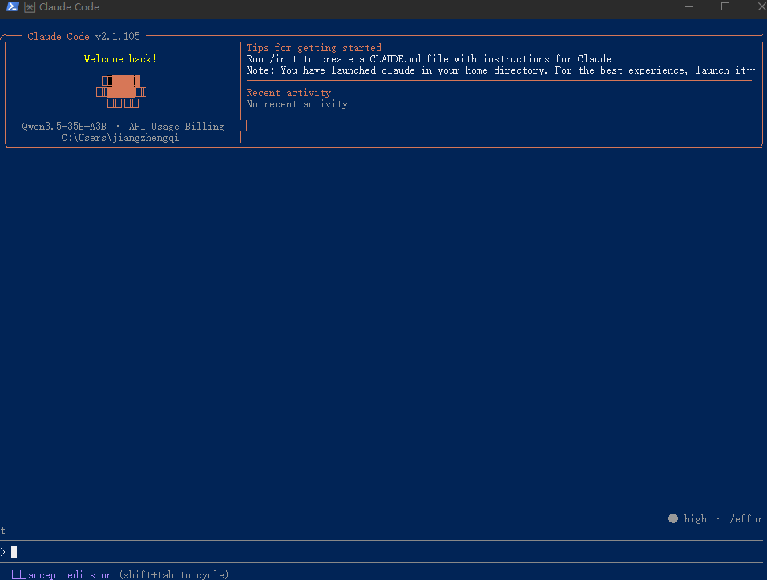
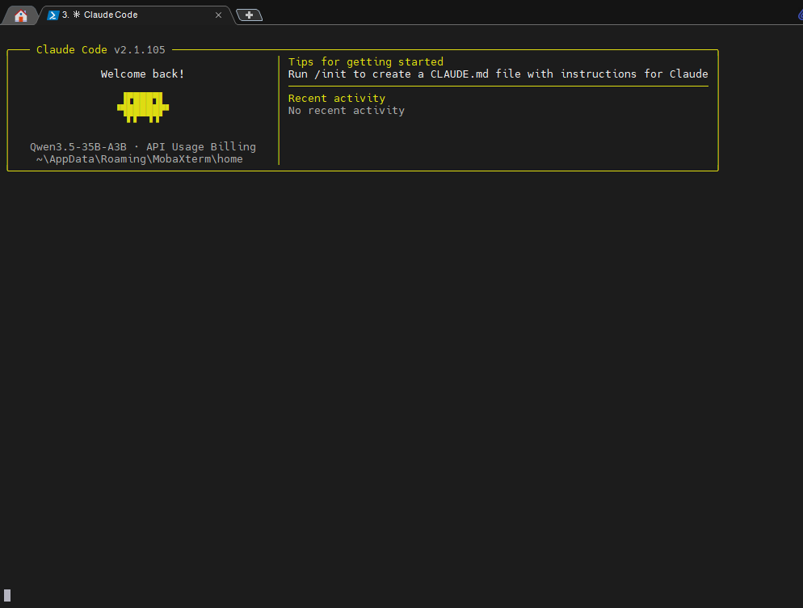
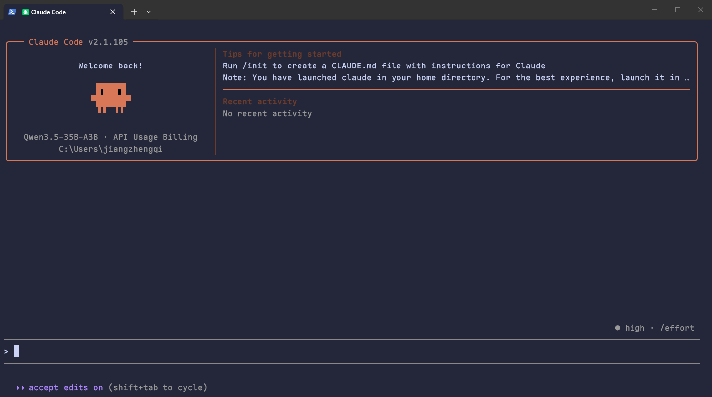
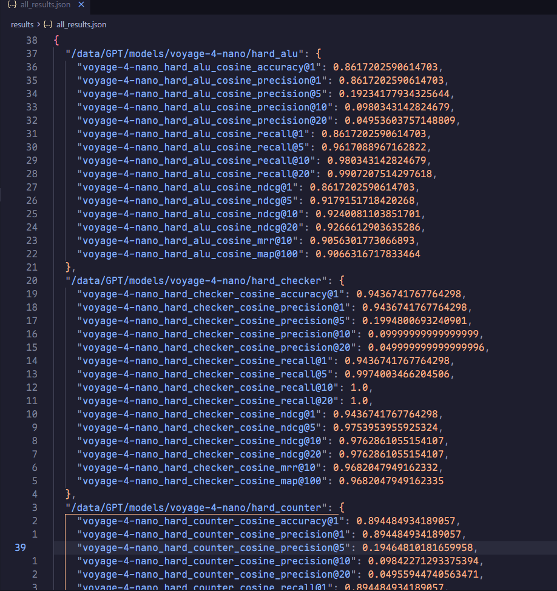

# Claude Code 使用介绍

中研院 数据平台 · 蒋正颀 &nbsp; | &nbsp; jiangzhengqi@fmsh.com.cn

<div class="abs-br m-6 text-sm opacity-50">2026.05</div>

---
layout: intro
hideInToc: true
---

# 目录

<Toc :columns="1" :maxDepth="2" />

---
layout: section
---

# 简介

---
layout: two-cols-header
---

## Claude Code 是什么

::left::

### What

- Claude Code (后文部分简称 CC)  是 Anthropic 发布的 **Agentic Coding CLI 工具**, 在终端中直接与 Claude *(或其他 LLM)* 对话完成编码任务
- 不一定是最好的，但是 MCP、Skills 等概念都是 Anthropic 提出的，是 Agent 发展的最前沿，范式变革的引领者


### How
本质都还是 Agentic Loop 自主循环

> 理解需求 → 收集上下文 → 执行操作 → 验证结果 → 继续迭代

### 和 OpenClaw 🦞的区别

- 龙虾🦞的目标是**通用化**的智能体，克隆一个你的「数字分身」
- Coding Agent 的目标是针对编码 / 开发 / 分析等场景优化，**代码专精**
- 🦞写代码不是不行，但是大概率不如 CC 质量高
- 🦞可以「派」CC 去完成编码/分析任务，自己专注于全局安排
- 🦞能干的，CC 能吗？也可以，以前没有🦞时就有教你用 CC 写小红书文案的，只不过现在领域各自分开了

::right::


### Why

和 IDE 提供的代码补全、一部分的"智能"插件相比：

| 优势 | 说明 |
|:------:|:------:|
| 终端原生 | 与 IDE 解耦，不受 IDE 限制，**服务器上也能用** |
| 全项目感知 | 读 CLAUDE.md、rules、记忆，理解项目上下文 |
| 端到端自主执行 | 不需逐步指令，给目标即可执行情况自动迭代 |
| 可扩展 | **Plugin 扩展能力** (MCP / Skills / Subagent) |
| 可自动化 | Hooks 拦截生命周期，可非交互式调用、代码调用 |
| 多 Agent | Subagent 并行，Team 协作 |


**核心能力**

- **读** — 理解整个代码库结构、依赖关系
- **写** — 编辑文件、创建新文件、重构代码
- **执行** — 运行命令、测试、构建、部署
- **集成** — Git、MCP、LSP、Hooks、Plugins

---
layout: two-cols-header
---

## 对研发来说，能做什么

::left::

### 🧠 代码理解与生成

- 读 RTL / Firmware / Testbench
- 解释接口、状态机、寄存器、启动流程
- 生成 wrapper、驱动、测试脚本草稿

### 🧪 验证与调试

- 生成 UVM / SVA / testbench 草稿
- 分析仿真、regression、bring-up log
- 对比 good / bad case，定位 first error


### 📊 报告与问题分析

- 分析 timing / area / power / lint / CDC 报告
- 提取关键指标、失败路径和 top offenders
- 归类问题原因，生成优化建议

::right::

### ⚙️ 流程自动化

- 编写 Tcl / Python / Bash / Perl 脚本
- 批量运行仿真、综合、实现、回归测试
- 自动汇总结果并生成表格/报告

### 📚 文档与知识沉淀

- 生成模块说明、接口文档、寄存器表
- 整理 checklist、release note、验证计划
- 帮助新人快速理解老项目
- 第三方项目解读

---
layout: section
---

# 安装 & 配置

---

## 安装

### 1. 安装 Node.js (推荐 24 版本)

- Windows 安装: https://registry.npmmirror.com/-/binary/node/latest-v24.x/node-v24.9.0-x64.msi
- Linux 安装: https://registry.npmmirror.com/-/binary/node/latest-v24.x/node-v24.9.0-linux-x64.tar.xz

### 2.1 通过 NPM 安装 Claude Code

- NPM 是 Node.js 的包管理器, 类似于 Python 的 pip、Java 的 Maven 等, 或者是 Ubuntu 的 apt 等
  ```bash
  npm config set -g registry https://registry.npmmirror.com
  ```

- 执行命令
  ```bash
  npm install -g @anthropic-ai/claude-code@latest
  ```

- 截止目前 v2.1.141 版本, 会下载约 70 MB 的文件, 请耐心等待

- 后续如果升级也执行相同的命令

---
hideInToc: true
---

## 安装

### 1. 安装 Node.js (推荐 24 版本)

- Windows 安装: https://registry.npmmirror.com/-/binary/node/latest-v24.x/node-v24.9.0-x64.msi
- Linux 安装: https://registry.npmmirror.com/-/binary/node/latest-v24.x/node-v24.9.0-linux-x64.tar.xz

### 2.2 离线安装 Claude Code（无网环境安装）

- 下载提供的 `.tgz` 包
  - `anthropic-ai-claude-code-2.1.141.tgz`
  - 下面两个根据系统二选一:
    - `anthropic-ai-claude-code-win32-x64-2.1.141.tgz`
    - `anthropic-ai-claude-code-linux-x64-2.1.141.tgz`

- 执行命令（以 Linux 服务器为例）
  ```bash
  npm install -g ./anthropic-ai-claude-code-2.1.141.tgz ./anthropic-ai-claude-code-win32-x64-2.1.141.tgz
  ```

---
hideInToc: true
---

## 安装

### 3. 安装终端软件 Windows Terminal (微软出品, Windows 10 / 11 推荐的终端软件)

https://github.com/microsoft/terminal/releases/download/v1.24.11321.0/Microsoft.WindowsTerminal_1.24.11321.0_8wekyb3d8bbwe.msixbundle

- 不要用: Windows 自带的 CMD / PowerShell 窗口, 渲染技术落后、性能差
- MobaXTerm 可能有渲染问题
- 推荐 Windows Terminal, 其他可选: WezTerm / Alacritty / Tabby / Warp / VSCode自带终端 等等

<div class="grid grid-cols-3 gap-4">

  

  

  

</div>

---

## 基础配置

- Claude Code 默认连接 Anthropic 官网（需要账号和费用）。我们使用内部部署（**不联网，但在互联网段**）的模型，需要做一次配置。**研发网段暂时还无法使用**
  - 内部模型现在是 **Qwen3.6 系列的 35B-A3B MoE 模型**，支持 256K 上下文
  - 如果你买了商业的大模型 API / Coding Plan，比如阿里百炼 / 字节火山 / 智谱GLM / Kimi 等，配置也是类似方法
- 配置文件位置：`$HOME/.claude/settings.json`（Windows：`C:\Users\你的用户名\.claude\settings.json`）

```json [~/.claude/settings.json]
{
  "env": {
    "ANTHROPIC_BASE_URL": "http://192.168.130.101:10303",
    "ANTHROPIC_AUTH_TOKEN": "sk-g6qzdRr6ymPGY0o3019e1b62130f7e5aBcF74e80E3057250",
    "ANTHROPIC_DEFAULT_HAIKU_MODEL": "Qwen3.6-35B-A3B",
    "ANTHROPIC_DEFAULT_SONNET_MODEL": "Qwen3.6-35B-A3B",
    "ANTHROPIC_DEFAULT_OPUS_MODEL": "Qwen3.6-35B-A3B",
    "ANTHROPIC_MODEL": "Qwen3.6-35B-A3B",
    "API_TIMEOUT_MS": "3000000",
    "ENABLE_LSP_TOOL": "1",
    "CLAUDE_CODE_EXPERIMENTAL_AGENT_TEAMS": "1", "CLAUDE_CODE_NO_FLICKER": "1",
    "CLAUDE_CODE_ATTRIBUTION_HEADER": "0", "CLAUDE_CODE_DISABLE_NONESSENTIAL_TRAFFIC": "1",
    "DISABLE_TELEMETRY": "1", "DISABLE_COST_WARNINGS": "1"
  },
  "permissions": { "defaultMode": "acceptEdits" },
  "language": "简体中文, Chinese"
}
```


---

## 启动

在 **项目目录下** 执行 `claude` 命令

```bash
cd D:\projects\xxx
claude
# 或者打开会话选择器, 继续先前对话
claude --resume
```

- 初次启动，Claude Code 会问你是否信任当前文件夹，为什么？因为如果项目内含脚本，Claude Code 有可能去执行，但 Claude Code 不保证脚本的内容安全
   - 用户目录永远不会被加入「受信任工作区列表」
- 启动后你会看到一个对话界面，就像豆包 / Kimi 一样，用中文输入你的需求即可
- 推荐执行 `/init` 命令，以创建一个初始的 CLAUDE.md 文件，作为**项目级的「系统提示词」**
  - CC 会探索整个项目，总结出一套规范 / 约束，加入 CLAUDE.md 中，也可以你自己再进行一次审阅
  - 新项目，可以先手动写一些团队内通用的规范，后续再逐渐增补
  - 如果规则非常复杂，可以参考 [使用`~/.claude/rules/`组织规则](https://code.claude.com/docs/zh-CN/memory#%E4%BD%BF%E7%94%A8-claude/rules/-%E7%BB%84%E7%BB%87%E8%A7%84%E5%88%99) 来组织
- 类似 Vim，绝大多数操作都用键盘完成（方向键、回车键、Esc 键等等）。要退出 Claude Code **双击 <kbd>Ctrl</kbd>+<kbd>C</kbd>**，一下是中断当前操作，两下是退出

**它能主动读取**

- 你当前目录下的所有文件、你指定的文件路径
- 运行命令后的输出结果、报错信息
- （安装 LSP 插件后）代码检查信息 (Warning & Error)

**它不会**

- 上传文件到云端、访问其电脑/服务器、访问互联网（除非你给他搜索引擎工具）
- 项目外的文件（需用户同意）

---
layout: section
---

# 实用配置

---

## 权限

`--permission-mode` / 配置中的 `defaultMode`: 6 种模式

| 模式 | 自动放行 | 典型场景 |
|------|---------|---------|
| `default` | 仅读取 |  |
| `acceptEdits` | 读取 + 编辑 + `mkdir`/`mv`/`cp` | **日常开发（推荐）** |
| `plan` | 仅读取，不编辑 | 先分析再动手；读代码 |
| `auto` | 全部（独立分类器审查） |  |
| `dontAsk` | 仅 `allow` 预批准的 | CI/CD 管道；SDK 调用 CC |
| `bypassPermissions` | 全部，无任何保护 | **放心大胆干** |

- <kbd>Shift + Tab</kbd> 在会话内循环切换

`--dangerously-skip-permissions` — 跳过所有权限检查

怎么跳过某些工具的权限请求？参考文档

> https://code.claude.com/docs/zh-CN/permissions

---

## 实用操作

### 命令行

**会话控制**

```bash
claude -c / --continue              # 继续最近的会话
claude -r / --resume                # 打开会话选择器

claude -n "auth-refactor"           # 命名会话（显示在 /resume）
claude --fork-session               # 分叉（不覆盖原会话历史）
```

**添加上下文**

```bash
# 添加额外可访问目录
claude --add-dir ../shared-lib ../docs
```

### 交互界面内

- `/` 执行内置命令，`@` 引用文件，`!` 执行 shell 脚本
- 用 `/rewind` 命令或者 **双击 <kbd>ESC</kbd>** 键，可以撤销上一次 Claude 的更改、回退对话
- CC 执行过程中可以按 <kbd>ESC</kbd> 打断，补充信息或者纠正错误
- `/plugin` 命令管理插件，`/skills` 命令管理技能包
- `/copy` 命令把 CC 的输出复制到剪贴板

---

## 插件与技能包

### 安装方式 1: 手动安装

```
.claude/skills/
└── code-review/
    └── SKILL.md     # 提交 Git 即可团队共享
```

### (推荐) 安装方式 2: skills.sh 市场一键安装

[skills.sh](https://skills.sh) 是开放 Skill 社区，每个技能都经过三个不同引擎的安全扫描，包含超 1.5M 个技能，由 Vercel 维护 (GitHub 项目地址 [vercel-labs/skills](https://github.com/vercel-labs/skills))

```bash
# 从 GitHub 仓库安装
npx skills add vercel-labs/agent-skills # 默认从 GitHub 仓库安装
npx skills add http://xxxx.git          # 从指定 Git 安装
# 管理已安装 Skills
npx skills list              # 列出所有
npx skills check             # 检查更新
npx skills update            # 更新全部
```

支持 **Claude Code、Codex、Cursor、Trae** 等 50+ Agent，自动检测

### 安装方式 3: 随插件一起安装

(后续)

---
hideInToc: true
---

## 插件与技能包

### 安装方式 3: 随插件一起安装

- Claude Code 插件包含 skills、agents、hooks 和 MCP servers 等，是 Claude Code 推荐的扩展方式
- 缺点：其他智能体不通用；需连接 GitHub 下载

**插件市场**

- Claude Code 官方维护了一个插件市场，运行 `/plugin marketplace add anthropics/claude-plugins-official` 以添加
- 亦有很多其他社区维护的插件市场，运行 `/plugin marketplace add <git地址>` 以添加，不过绝大多数高质量插件都已经被官方收录
- 执行 `/plugin` 以交互式进行插件的搜索和管理

**LSP插件** (代码智能)

- 一类特殊插件，提供 **LSP (Language Server Protocol)** 支持，即代码智能，如类型检查、跳转定义、错误信息等
- VSCode / Vim 等的代码跳转就是基于 LSP 实现。有了 LSP，CC 想看一个函数被调用的情况，不再使用字符串搜索，而是直接「跳转」到对应位置

**superpowers**

- ⭐ **必装插件**
- 在执行任务之前，会先指引 CC 确认每一个细节，并且自己进行一下头脑风暴，对模糊的、多方案的点，向用户确认清楚

---
layout: section
---

# 案例展示

---
layout: two-cols-header
---

## 综合后网表分析（帮忙写脚本）

### 背景

参与逆综合项目中，我们平台组负责提供智能体、深度学习方面的支持，但是对硬件知识有限，需要借助 AI 为「附加大脑」，比如网表到低对应一个什么样的电路，我希望借助 AI 帮忙做一下可视化和分析。

```verilog
module dcd_prout ( xm3829, xm7822, xm6376, /* ... */);
  input xm3829;
  input xm7822;
  input xm6376;
  // ...
  wire   N55, N56 /* ... */ ;
  // ...
  INV data$U89 ( .I(xm4735), .ZN(n117) );
  INV data$U90 ( .I(xm2730), .ZN(n136) );
  AN2 data$U91 ( .A1(n117), .A2(n136), .Z(n134) );
  INV data$U92 ( .I(xm8174), .ZN(n135) );
  // ...
endmodule
```


### 我的输入

```markdown
## 任务目标
编写脚本，基于 PySlang 进行语法解析，然后做以下事情：
- 对于 RTL 代码：Always 块提取 & 拆解，拆分出子 module，尽可能一个 always 块是一个 .v 文件
- 对于网表文件：总线识别，并一路追踪，输出一路涉及的实例，给出一条“路”
- 网表结合 RTL 文件：找出 Condition，如条件复位信号、FSM 的转移条件等，并标注（输出到新文件）
## 环境
- 基于 uv，以 `uv run xxx.py` 执行 Python 脚本，或 `uv run -m` 执行模块，不要裸地直接执行 python 命令，uv 会自动使用虚拟环境
- 如果万不得已需要执行 python，也以 `uv run python ...` 执行
- 依赖已安装，包括但不限于 pyslang、pyverilog、networkx、numpy 等
## 样例数据
- 目录下提供了 A_SC6.v 和 fifo_controller.v 两个网表文件及其各自对应的 RTL 代码（以 .rtl.v 结尾）供你进行脚本调试
```


---
hideInToc: true
layout: iframe
url: /replay/ClaudeReplay-网表分析脚本.html
---

---
hideInToc: true
---


---
layout: two-cols-header
---

## 数据可视化

::left::

### 背景

- 依旧逆综合项目，评价向量模型对 RTL 代码的召回能力，即根据一段自然语言描述，或者一个 Spec，能否从海量的 RTL 代码中语义检索到对应的代码。


1. 我让大模型根据一定的规则，将 8 万多个代码分成不同任务子集（ALU、FSM、Decoder 等），用于评估相似功能下的区分能力。但是子集的数据在一个大 JSON 文件，不方便看，我要大模型做一个**数据查看器**
2. 在不同设置下跑了不同的结果，输出为 JSON 文件，包含模型信息、任务名、各项评估指标，我需要进行**结果可视化**方便比较

::right::

{width=500px}


---
hideInToc: true
layout: iframe
url: http://192.168.126.193:8765/eval_viewer.html
---

---
hideInToc: true
layout: iframe
url: http://192.168.126.193:8765/dataset_viewer.html
---


---
hideInToc: true
layout: iframe
url: /replay/ClaudeReplay-数据分析+可视化.html
---

---
layout: two-cols-header
hideInToc: true
---

## 让 Claude Code 表现更好的几个技巧

<div class="mt-4 grid grid-rows-3 gap-4">

<div class="p-4 bg-green-50 border border-green-300 rounded-xl">
  <div class="font-bold text-green-700 mb-1">✅ 好的需求描述方式</div>
  <ul class="text-base space-y-1 text-gray-700">
    <li>明确说了文件名</li>
    <li>把任务拆成清晰的编号列表</li>
    <li>说清楚了每项的预期输出形式、验证方式</li>
  </ul>
</div>

<div class="p-4 bg-yellow-50 border border-yellow-300 rounded-xl">
  <div class="font-bold text-yellow-700 mb-1">💡 不用担心说错</div>
  <ul class="text-base space-y-1 text-gray-700">
    <li>Claude 会先问你确认</li>
    <li>随时可以说"不对，我的意思是..."</li>
    <li>一次说不清很正常，分多轮修正细节</li>
  </ul>
</div>

<div class="p-4 bg-blue-50 border border-blue-300 rounded-xl">
  <div class="font-bold text-blue-700 mb-1">🔑 核心原则</div>
  <ul class="text-base space-y-1 text-gray-700">
    <li>说<strong>目标</strong>，不用说步骤，给予智能体一定的探索自由度</li>
    <li>告诉他"做什么"，让他想"怎么做"</li>
  </ul>
</div>

</div>
---
layout: center
class: text-center
hideInToc: true
---

# 谢谢

蒋正颀 jiangzhengqi@fmsh.com.cn

- 文档 https://code.claude.com/docs
- 最佳实践 (必读) https://code.claude.com/docs/zh-CN/best-practices

---
layout: end
hideInToc: true
---
